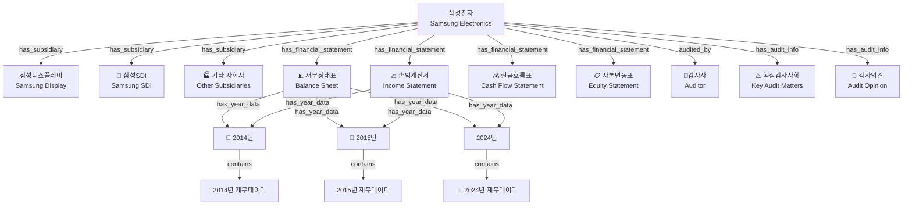
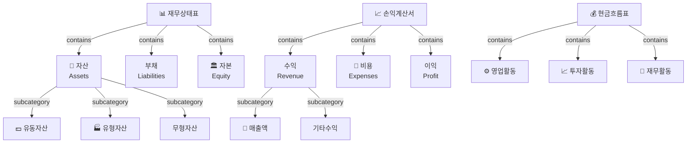
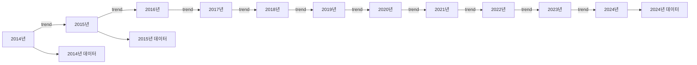

## 🎯 개선된 지식 그래프 구조

### 1. **전체 아키텍처**



### 2. **세부 노드 구조**



### 3. **시계열 분석 구조**



### 4. **구현을 위한 노드 타입 정의**

```python
# 노드 타입 정의
NODE_TYPES = {
    "COMPANY": "company",                    # 삼성전자
    "SUBSIDIARY": "subsidiary",              # 자회사
    "FS_SECTION": "financial_statement",     # 재무제표 섹션
    "FS_CATEGORY": "fs_category",            # 재무제표 세부 카테고리
    "YEAR_NODE": "year_node",                # 년도별 노드
    "AUDITOR": "auditor",                    # 감사사
    "AUDIT_INFO": "audit_info",              # 감사 정보
    "FINANCIAL_DATA": "financial_data",      # 실제 재무 데이터
    "CONCEPT": "concept",                    # 재무 개념
    "RISK_TERM": "risk_term"                 # 리스크 용어
}

# 관계 타입 정의
RELATIONSHIP_TYPES = {
    "HAS_SUBSIDIARY": "has_subsidiary",
    "HAS_FINANCIAL_STATEMENT": "has_financial_statement",
    "HAS_CATEGORY": "has_category",
    "HAS_YEAR_DATA": "has_year_data",
    "CONTAINS_DATA": "contains_data",
    "AUDITED_BY": "audited_by",
    "HAS_AUDIT_INFO": "has_audit_info",
    "TREND_TO": "trend_to",
    "RELATED_TO": "related_to",
    "MAPPED_TO": "mapped_to"
}
```

### 5. **데이터베이스 스키마 확장**

```sql
-- 회사 및 자회사 테이블
CREATE TABLE COMPANIES (
    company_id VARCHAR(50) PRIMARY KEY,
    name_ko VARCHAR(100) NOT NULL,
    name_en VARCHAR(100),
    company_type VARCHAR(20), -- 'parent', 'subsidiary'
    parent_company_id VARCHAR(50),
    ownership_percentage DECIMAL(5,2),
    created_at TIMESTAMP DEFAULT CURRENT_TIMESTAMP
);

-- 재무제표 섹션 테이블
CREATE TABLE FINANCIAL_STATEMENT_SECTIONS (
    section_id VARCHAR(50) PRIMARY KEY,
    section_type VARCHAR(10) NOT NULL, -- 'BS', 'PL', 'CF', 'EQ'
    section_name_ko VARCHAR(100),
    section_name_en VARCHAR(100),
    description TEXT,
    created_at TIMESTAMP DEFAULT CURRENT_TIMESTAMP
);

-- 재무제표 카테고리 테이블
CREATE TABLE FINANCIAL_STATEMENT_CATEGORIES (
    category_id VARCHAR(50) PRIMARY KEY,
    section_id VARCHAR(50) REFERENCES FINANCIAL_STATEMENT_SECTIONS(section_id),
    category_name_ko VARCHAR(100),
    category_name_en VARCHAR(100),
    parent_category_id VARCHAR(50),
    hierarchy_level INTEGER DEFAULT 1,
    created_at TIMESTAMP DEFAULT CURRENT_TIMESTAMP
);

-- 년도별 노드 테이블
CREATE TABLE YEAR_NODES (
    year_node_id VARCHAR(50) PRIMARY KEY,
    fiscal_year INTEGER NOT NULL,
    company_id VARCHAR(50) REFERENCES COMPANIES(company_id),
    section_id VARCHAR(50) REFERENCES FINANCIAL_STATEMENT_SECTIONS(section_id),
    data_summary JSONB,
    created_at TIMESTAMP DEFAULT CURRENT_TIMESTAMP
);

-- 감사 정보 테이블
CREATE TABLE AUDIT_INFORMATION (
    audit_info_id VARCHAR(50) PRIMARY KEY,
    report_id VARCHAR(50) REFERENCES REPORTS(report_id),
    auditor_id VARCHAR(50),
    audit_opinion VARCHAR(50),
    key_audit_matters JSONB,
    emphasis_of_matter TEXT,
    created_at TIMESTAMP DEFAULT CURRENT_TIMESTAMP
);
```

### 6. **시각화 레이어 구조**

```
Layer 1: 회사 및 자회사 관계
├── 삼성전자 (중앙)
├── 삼성디스플레이
├── 삼성SDI
└── 기타 자회사

Layer 2: 재무제표 섹션
├── 재무상태표 (BS)
├── 손익계산서 (PL)
├── 현금흐름표 (CF)
└── 자본변동표 (EQ)

Layer 3: 재무제표 세부 카테고리
├── 자산 (자산, 부채, 자본)
├── 수익 (매출액, 기타수익)
├── 비용 (매출원가, 판관비)
└── 현금흐름 (영업, 투자, 재무)

Layer 4: 년도별 노드
├── 2014년 데이터
├── 2015년 데이터
├── ...
└── 2024년 데이터

Layer 5: 실제 재무 데이터
├── 구체적인 수치
├── 비율 분석
├── 트렌드 분석
└── 비교 분석
```

### 7. **사용자 인터페이스 제안**

```
📊 삼성전자 지식 그래프
├── 회사 정보
│   ├── 기본 정보
│   ├── 자회사 관계
│   └── 감사 정보
├── 재무제표
│   ├── 재무상태표
│   │   ├── 2014년 → 2024년
│   │   └── 자산/부채/자본 세부
│   ├── 손익계산서
│   │   ├── 2014년 → 2024년
│   │   └── 수익/비용/이익 세부
│   ├── 현금흐름표
│   └── 자본변동표
├── 분석 도구
│   ├── 시계열 분석
│   ├── 비율 분석
│   ├── 비교 분석
│   └── 트렌드 분석
└── 검색 및 필터
    ├── 키워드 검색
    ├── 연도별 필터
    ├── 섹션별 필터
    └── 고급 검색
```


# 기존 스키마랑 비교

### 1. **구조적 차이점**

#### 기존 스키마
```
데이터베이스 중심의 관계형 모델
├── 정규화된 테이블 구조
├── 외래키 기반 관계
├── 엔티티별 분리된 테이블
└── SQL 기반 쿼리 최적화
```

#### 제안한 시각화 구조
```
그래프 중심의 노드-엣지 모델
├── 계층적 노드 구조
├── 관계 기반 탐색
├── 시각적 탐색 경로
└── 사용자 중심 인터페이스
```

### 2. **핵심 차이점 상세 분석**

#### A. **데이터 모델링 접근법**

| 구분 | 기존 스키마 | 제안한 구조 |
|------|-------------|-------------|
| **접근법** | 관계형 데이터베이스 | 그래프 데이터베이스 |
| **핵심 개념** | 테이블-행-열 | 노드-엣지-속성 |
| **관계 표현** | 외래키 | 직접 연결 |
| **탐색 방식** | JOIN 쿼리 | 그래프 순회 |

#### B. **회사 및 자회사 관계**

**기존 스키마:**
```sql
COMPANIES {
    company_id INTEGER PK
    name_ko TEXT
    name_en TEXT
    -- 자회사 관계가 명시적으로 정의되지 않음
}

COMPETITOR_RELATIONS {
    company_id INTEGER FK
    competitor_id INTEGER FK
    relation_type TEXT
    -- 경쟁사 관계만 정의
}
```

**제안한 구조:**
```mermaid
삼성전자 --has_subsidiary--> 삼성디스플레이
삼성전자 --has_subsidiary--> 삼성SDI
삼성전자 --has_subsidiary--> 기타자회사
```

#### C. **재무제표 구조 표현**

**기존 스키마:**
```sql
FINANCIAL_STATEMENTS {
    statement_type TEXT -- 'BS', 'PL', 'CF', 'EQ'
    -- 단순한 문자열 분류
}

FINANCIAL_STATEMENT_LINES {
    raw_label TEXT
    concept_id INTEGER FK
    -- 개별 라인 아이템만 표현
}
```

**제안한 구조:**
```
재무상태표 (BS)
├── 자산 (Assets)
│   ├── 유동자산
│   ├── 유형자산
│   └── 무형자산
├── 부채 (Liabilities)
└── 자본 (Equity)
```

#### D. **시간 차원 처리**

**기존 스키마:**
```sql
REPORTS {
    fiscal_year INTEGER
    -- 연도별 보고서만 분리
}

FINANCIAL_STATEMENT_LINES {
    amount_current NUMERIC
    amount_prior NUMERIC
    -- 당기/전기 비교만
}
```

**제안한 구조:**
```
2014년 --trend--> 2015년 --trend--> 2016년 ... --trend--> 2024년
├── 재무상태표 데이터
├── 손익계산서 데이터
└── 현금흐름표 데이터
```

### 3. **주요 개선사항**

#### A. **시각화 친화적 구조**
- **기존**: 테이블 중심의 복잡한 JOIN
- **제안**: 직관적인 노드-엣지 탐색

#### B. **계층적 정보 표현**
- **기존**: 평면적인 테이블 구조
- **제안**: 다단계 계층 구조 (회사 → 섹션 → 년도 → 데이터)

#### C. **사용자 탐색 경로**
- **기존**: SQL 쿼리 작성 필요
- **제안**: 클릭 기반 드릴다운 탐색
