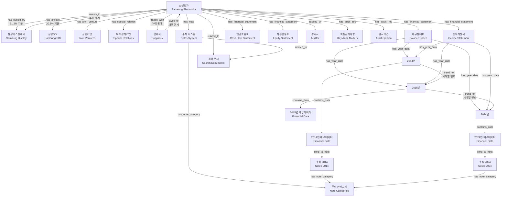
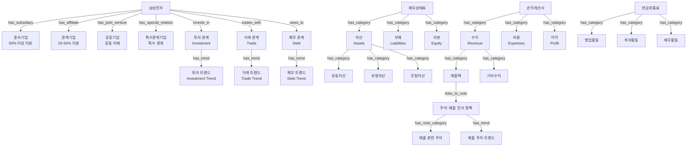

# 삼성전자 금융 지식그래프 프로젝트

## 프로젝트 개요
본 프로젝트는 **삼성전자 주주**를 주요 타겟으로 하여,  
2014년부터 2024년까지의 **11개년 감사보고서**를 바탕으로  
**핵심 감사 및 재무 정보를 한눈에 확인할 수 있는 금융 지식그래프**를 구축하는 것을 목표로 합니다.

### 목적
- 매년 감사보고서의 핵심 내용을 주주가 빠르게 이해할 수 있도록 **시각적이고 탐색 가능한 구조** 제공
- 숫자 중심의 재무제표뿐만 아니라, **주석·사업부문·개념 관계**를 그래프 형태로 직관화
- 장기적으로는 **금융 도메인 특화 QA/NLP 시스템**의 기반 데이터베이스로 활용 가능

---

## 프로젝트 실행 방법

#### 1. Install dependencies
```bash
pip install -r requirements.txt
```

#### 2. Run html parser
```bash
python src/audit_report_parser_v3.py
```

#### 3. Check processed data
- data/processed 경로에 파싱, 전처리 된 2014 ~ 2024년도 json 파일


#### 4. ETL 진행(json > neo4j DB 등록)
- 파싱 한 json 데이터를 neo4j DB에 등록하기 위한 ETL 과정 파이프라인
- 자세한 파이프라인 과정은 `cli.py`, `etl_optimized.py` 참고
  
```bash
# 모든 년도 한 번에 처리
NEO4J_URI=bolt://localhost:7687 NEO4J_USER=neo4j NEO4J_PASSWORD=password python -m src.structured_etl.cli run --all --clear-existing --force
```

#### 5. 챗봇 실행
- 구체적인 내용은 `chat-bot/README.md` 참조

---

## 기술 스택
- **언어**: Python 3.13.5
- **데이터 파싱**: BeautifulSoup4
- **데이터베이스**: Neo4j (AuraDB Free / Community Edition)
- **드라이버**: Neo4j Python Driver
- **시각화**: Neo4j Browser, Neo4j Bloom
- **버전 관리**: Git, GitHub

---

## 🎯 개선된 지식 그래프 구조

### 1. **최종 구현된 전체 아키텍처**



### 2. **세분화된 회사 관계 및 시계열 구조**



### 3. **종합 시계열 분석 구조**

```mermaid
graph LR
    %% 년도 간 시계열 연결 (재무제표)
    Year2014[2014년] --> |trend_to<br/>재무 변화| Year2015[2015년]
    Year2015 --> |trend_to<br/>재무 변화| Year2016[2016년]
    Year2016 --> |trend_to<br/>재무 변화| Year2017[2017년]
    Year2017 --> |trend_to<br/>재무 변화| Year2018[2018년]
    Year2018 --> |trend_to<br/>재무 변화| Year2019[2019년]
    Year2019 --> |trend_to<br/>재무 변화| Year2020[2020년]
    Year2020 --> |trend_to<br/>재무 변화| Year2021[2021년]
    Year2021 --> |trend_to<br/>재무 변화| Year2022[2022년]
    Year2022 --> |trend_to<br/>재무 변화| Year2023[2023년]
    Year2023 --> |trend_to<br/>재무 변화| Year2024[2024년]
    
    %% 각 년도별 데이터 및 트렌드 분석
    Year2014 --> |contains_data| Data2014[2014년 재무데이터]
    Year2014 --> |has_trend| Trend2014[2014년 트렌드 분석]
    
    Year2024 --> |contains_data| Data2024[2024년 재무데이터]
    Year2024 --> |has_trend| Trend2024[2024년 트렌드 분석]
    
    %% 회사 관계의 시계열 변화
    Data2014 --> |has_relationship| Rel2014[2014년 회사 관계]
    Data2024 --> |has_relationship| Rel2024[2024년 회사 관계]
    Rel2014 --> |has_change| RelChange[관계 변화 추적]
    Rel2024 --> |has_change| RelChange
    
    %% 주석의 시계열 변화
    Data2014 --> |links_to_note| Note2014[2014년 주석]
    Data2024 --> |links_to_note| Note2024[2024년 주석]
    Note2014 --> |has_change| NoteChange[주석 변화 추적]
    Note2024 --> |has_change| NoteChange
```



### 4. **최종 구현된 노드 타입 및 관계 정의**

#### 4.1 확장된 Node Types
```python
NODE_TYPES = {
    # 기본 구조
    "COMPANY": "company",                    # 삼성전자
    "SUBSIDIARY": "subsidiary",              # 종속기업 (50% 이상 지분)
    "AFFILIATE": "affiliate",                # 관계기업 (20-50% 지분)
    "JOINT_VENTURE": "joint_venture",        # 공동기업
    "SPECIAL_RELATION": "special_relation",  # 특수관계기업
    
    # 재무제표 구조
    "FS_SECTION": "financial_statement",     # 재무제표 섹션
    "FS_CATEGORY": "fs_category",            # 재무제표 세부 카테고리
    "YEAR_NODE": "year_node",                # 년도별 노드
    "FINANCIAL_DATA": "financial_data",      # 실제 재무 데이터
    
    # 감사 정보
    "AUDITOR": "auditor",                    # 감사사
    "AUDIT_INFO": "audit_info",              # 감사 정보
    
    # 주석 시스템
    "NOTE": "note",                          # 주석 본문
    "NOTE_CATEGORY": "note_category",        # 주석 유형
    
    # 시계열 분석
    "FINANCIAL_TREND": "financial_trend",    # 재무 트렌드 분석
    "RELATIONSHIP_CHANGE": "relationship_change", # 관계 변화 추적
    
    # 검색 및 개념
    "CONCEPT": "concept",                    # 재무 개념
    "RISK_TERM": "risk_term",                # 리스크 용어
    "SEARCH_DOC": "search_doc"               # 검색 문서
}
```

#### 4.2 확장된 Relationship Types
```python
RELATIONSHIP_TYPES = {
    # 회사 관계 세분화
    "HAS_SUBSIDIARY": "has_subsidiary",           # 종속기업 관계
    "HAS_AFFILIATE": "has_affiliate",             # 관계기업 관계
    "HAS_JOINT_VENTURE": "has_joint_venture",     # 공동기업 관계
    "HAS_SPECIAL_RELATION": "has_special_relation", # 특수관계기업
    
    # 회사간 재무 관계
    "INVESTS_IN": "invests_in",                   # 투자 관계
    "TRADES_WITH": "trades_with",                 # 거래 관계
    "OWES_TO": "owes_to",                         # 채무 관계
    "GUARANTEES_FOR": "guarantees_for",           # 보증 관계
    
    # 재무제표 구조
    "HAS_FINANCIAL_STATEMENT": "has_financial_statement",
    "HAS_CATEGORY": "has_category",
    "HAS_YEAR_DATA": "has_year_data",
    "CONTAINS_DATA": "contains_data",
    
    # 감사 정보
    "AUDITED_BY": "audited_by",
    "HAS_AUDIT_INFO": "has_audit_info",
    
    # 주석 시스템
    "HAS_NOTE": "has_note",
    "HAS_NOTE_CATEGORY": "has_note_category",
    "LINKS_TO_NOTE": "links_to_note",
    
    # 시계열 분석
    "TREND_TO": "trend_to",                       # 시계열 트렌드
    "HAS_TREND": "has_trend",                     # 트렌드 관계
    "HAS_CHANGE": "has_change",                   # 변화 관계
    "PRECEDES": "precedes",                       # 시간적 선후 관계
    
    # 일반 관계
    "RELATED_TO": "related_to",
    "MAPPED_TO": "mapped_to"
}
```

### 5. **최종 구현된 ETL 아키텍처**

#### 5.1 확장된 ETL 로더 구조
```
src/structured_etl/
├── kg_schema.py                    # 확장된 스키마 정의
├── etl_config.py                   # ETL 설정 및 구성
├── id_utils.py                     # 노드 ID 생성 유틸리티
├── neo4j_client.py                 # Neo4j 연결 관리
├── schema_apply.py                 # 제약조건 및 인덱스 적용
├── etl_optimized.py                # 최적화된 ETL 실행기
├── validate_graph.py               # 그래프 검증
│
├── load_company_enhanced.py        # 세분화된 회사 관계 로드
├── load_financial_relationships.py # 회사간 재무 관계 로드
├── load_financial_trends.py        # 재무 트렌드 분석 로드
├── track_relationship_changes.py   # 관계 변화 추적
├── load_fs_sections.py             # FS_SECTION 노드 로드
├── load_fs_categories.py           # FS_CATEGORY 노드 로드
├── load_year_nodes.py              # YEAR_NODE 노드 로드
├── load_financial_data_optimized.py # FINANCIAL_DATA 노드 로드
├── load_audit_info.py              # AUDITOR, AUDIT_INFO 노드 로드
├── load_notes.py                   # NOTE, NOTE_CATEGORY 노드 로드
├── load_concepts.py                # CONCEPT 노드 로드
├── load_risk_terms.py              # RISK_TERM 노드 로드
├── load_search_docs.py             # SEARCH_DOC 노드 로드
├── link_notes.py                   # 재무데이터-주석 링크 생성
├── link_trends.py                  # 시계열 트렌드 관계 생성
│
└── cli.py                          # CLI 인터페이스
```

#### 5.2 확장된 속성 정의 (PROPS)
```python
PROPS = {
    # 기본 식별자
    "id": "id",
    "name": "name", 
    "year": "year",
    "company": "company",
    
    # 회사 관계 속성
    "ownership_percentage": "ownership_percentage",  # 지분율
    "relationship_type": "relationship_type",        # 관계 유형
    "investment_amount": "investment_amount",        # 투자 금액
    "trade_amount": "trade_amount",                  # 거래 금액
    "debt_amount": "debt_amount",                    # 채무 금액
    
    # 재무제표 구조
    "section_code": "section_code",                  # BS | PL | CI | CF | EQ
    "category_path": "category_path",                # Assets>CurrentAssets>Cash
    "category_name": "category_name",
    "hierarchy_level": "hierarchy_level",
    
    # 재무 데이터
    "item_name": "item_name",
    "column_name": "column_name", 
    "original_text": "original_text",
    "value": "value",
    "unit": "unit",
    "currency": "currency",
    "is_negative": "is_negative",
    "note_references": "note_references",
    
    # 주석 관련
    "note_number": "note_number",
    "category": "category",
    "confidence": "confidence",
    "text": "text",
    "content": "content",
    
    # 감사 정보
    "audit_type": "audit_type",
    "audit_opinion": "audit_opinion", 
    "audit_date": "audit_date",
    "auditor_name": "auditor_name",
    
    # 시계열 분석
    "change_rate": "change_rate",                    # 변화율
    "change_amount": "change_amount",                # 변화량
    "trend_direction": "trend_direction",            # 트렌드 방향
    "volatility": "volatility",                      # 변동성
    "growth_rate": "growth_rate",                    # 성장률
    
    # 회사간 재무 관계
    "transaction_type": "transaction_type",
    "amount_current": "amount_current",
    "amount_previous": "amount_previous",
    "transaction_direction": "transaction_direction",
    "reporting_year": "reporting_year",
    "guarantee_type": "guarantee_type",
    "guarantee_limit": "guarantee_limit",
    "collateral_type": "collateral_type",
    "interest_rate": "interest_rate",
    "maturity_date": "maturity_date",
    "transaction_details": "transaction_details"
}
```

### 6. **최종 구현된 시각화 레이어 구조**

```
Layer 1: 세분화된 회사 관계
├── 삼성전자 (중앙)
├── 종속기업 (50% 이상 지분)
│   ├── 삼성디스플레이
│   └── 기타 종속기업
├── 관계기업 (20-50% 지분)
│   ├── 삼성SDI
│   └── 기타 관계기업
├── 공동기업 (공동 지배)
└── 특수관계기업

Layer 2: 회사간 재무 관계 (시계열)
├── 투자 관계 (INVESTS_IN)
│   ├── 투자 금액 변화
│   └── 지분율 변화
├── 거래 관계 (TRADES_WITH)
│   ├── 매출/매입 변화
│   └── 거래 패턴 분석
├── 채무 관계 (OWES_TO)
│   ├── 미수금/미지급금
│   └── 채무 구조 변화
└── 보증 관계 (GUARANTEES_FOR)

Layer 3: 재무제표 섹션 (시계열 연결)
├── 재무상태표 (BS)
│   ├── 2014년 → 2024년 (TREND_TO)
│   └── 자산/부채/자본 변화
├── 손익계산서 (PL)
│   ├── 2014년 → 2024년 (TREND_TO)
│   └── 수익/비용/이익 변화
├── 현금흐름표 (CF)
└── 자본변동표 (EQ)

Layer 4: 재무제표 세부 카테고리
├── 자산 (Assets)
│   ├── 유동자산 변화 추적
│   ├── 유형자산 변화 추적
│   └── 무형자산 변화 추적
├── 수익 (Revenue)
│   ├── 매출액 트렌드
│   └── 기타수익 패턴
├── 비용 (Expenses)
│   ├── 매출원가 분석
│   └── 판관비 변화
└── 현금흐름 (Cash Flow)
    ├── 영업활동 현금흐름
    ├── 투자활동 현금흐름
    └── 재무활동 현금흐름

Layer 5: 주석-재무데이터 연계
├── 주석 카테고리별 분석
│   ├── 회계정책 변화
│   ├── 재무상태 변화
│   └── 손익계산 변화
├── 재무데이터-주석 연결
│   ├── LINKS_TO_NOTE 관계
│   └── 양방향 탐색 지원
└── 주석 시계열 변화
    ├── 주석 내용 변화
    └── 정책 변경 영향 분석

Layer 6: 종합 분석 및 트렌드
├── 재무 트렌드 분석
│   ├── 성장률 분석
│   ├── 변동성 분석
│   └── 계절성 분석
├── 관계 변화 추적
│   ├── 투자 관계 변화
│   ├── 거래 관계 변화
│   └── 채무 관계 변화
└── 종합 대시보드
    ├── 네트워크 시각화
    ├── 트렌드 차트
    └── 검색 및 필터링
```

### 7. **최종 구현된 사용자 인터페이스**

```
📊 삼성전자 지식 그래프
├── 회사 정보
│   ├── 기본 정보 (삼성전자)
│   ├── 세분화된 회사 관계
│   │   ├── 종속기업 (50% 이상 지분)
│   │   ├── 관계기업 (20-50% 지분)
│   │   ├── 공동기업 (공동 지배)
│   │   └── 특수관계기업
│   ├── 회사간 재무 관계
│   │   ├── 투자 관계 (INVESTS_IN)
│   │   ├── 거래 관계 (TRADES_WITH)
│   │   ├── 채무 관계 (OWES_TO)
│   │   └── 보증 관계 (GUARANTEES_FOR)
│   └── 감사 정보 (감사사, KAM, 감사의견)
├── 재무제표 (시계열 연결)
│   ├── 재무상태표 (BS)
│   │   ├── 2014년 → 2024년 (TREND_TO)
│   │   ├── 자산/부채/자본 세부
│   │   └── 시계열 변화 추적
│   ├── 손익계산서 (PL)
│   │   ├── 2014년 → 2024년 (TREND_TO)
│   │   ├── 수익/비용/이익 세부
│   │   └── 시계열 변화 추적
│   ├── 현금흐름표 (CF)
│   └── 자본변동표 (EQ)
├── 주석 시스템
│   ├── 주석 카테고리별 분석
│   │   ├── 회계정책 변화
│   │   ├── 재무상태 변화
│   │   └── 손익계산 변화
│   ├── 재무데이터-주석 연결
│   │   ├── LINKS_TO_NOTE 관계
│   │   └── 양방향 탐색 지원
│   └── 주석 시계열 변화
│       ├── 주석 내용 변화
│       └── 정책 변경 영향 분석
├── 고급 분석 도구
│   ├── 종합 시계열 분석
│   │   ├── 재무 트렌드 분석
│   │   ├── 회사 관계 변화 추적
│   │   └── 주석 변화 추적
│   ├── 관계 변화 분석
│   │   ├── 투자 관계 변화
│   │   ├── 거래 관계 변화
│   │   └── 채무 관계 변화
│   ├── 비율 분석 및 비교
│   └── 리스크 분석
└── 검색 및 필터
    ├── 전체 텍스트 검색 (SEARCH_DOC)
    ├── 키워드 검색
    ├── 연도별 필터
    ├── 섹션별 필터
    ├── 회사 관계별 필터
    └── 고급 검색 (복합 조건)
```


### 8. **최종 구현 상태 및 성능 최적화**

#### 8.1 구현된 기능들
- ✅ **세분화된 회사 관계**: 종속기업, 관계기업, 공동기업, 특수관계기업
- ✅ **회사간 재무 관계**: 투자, 거래, 채무, 보증 관계
- ✅ **시계열 변화 추적**: TREND_TO 관계 및 변화량/변화율 분석
- ✅ **재무제표 구조**: BS/PL/CF/EQ 섹션 및 세부 카테고리
- ✅ **주석 시스템**: NOTE, NOTE_CATEGORY 노드 및 분류
- ✅ **재무데이터-주석 연계**: LINKS_TO_NOTE 양방향 연결
- ✅ **검색 시스템**: SEARCH_DOC 기반 전체 텍스트 검색
- ✅ **감사 정보**: AUDITOR, AUDIT_INFO 노드
- ✅ **성능 최적화**: 배치 처리, 인덱스, 제약조건

#### 8.2 성능 최적화 요소
```python
# 배치 처리 (etl_optimized.py)
BATCH_SIZE = 500
MAX_RETRIES = 3

# 복합 인덱스 (schema_apply.py)
CREATE INDEX financial_item_year_idx FOR (n:financial_data) ON (n.item_name, n.year)
CREATE INDEX note_year_category_idx FOR (n:note) ON (n.year, n.category)
CREATE INDEX year_section_idx FOR (n:year_node) ON (n.year, n.section_code)
CREATE INDEX relationship_year_idx FOR (n:company) ON (n.year, n.relationship_type)

# 전체 텍스트 검색 인덱스
CREATE FULLTEXT INDEX search_doc_content_idx FOR (n:search_doc) ON EACH [n.content]
CREATE FULLTEXT INDEX note_text_idx FOR (n:note) ON EACH [n.text]
```

#### 8.3 데이터 품질 관리
- **ID 안정성**: SHA1 기반 deterministic ID 생성
- **검증 시스템**: validate_graph.py를 통한 데이터 품질 검증
- **에러 처리**: 재시도 메커니즘 및 배치 실패 복구
- **중복 제거**: MERGE 문을 통한 idempotent 로딩
- **시계열 무결성**: TREND_TO 관계의 연속성 검증


### 9. **기존 스키마와의 비교 분석**

#### 9.1 **구조적 차이점**

| 구분 | 기존 관계형 스키마 | 최종 구현된 KG 스키마 |
|------|-------------------|---------------------|
| **접근법** | 데이터베이스 중심의 관계형 모델 | 그래프 중심의 노드-엣지 모델 |
| **핵심 개념** | 테이블-행-열 | 노드-엣지-속성 |
| **관계 표현** | 외래키 기반 관계 | 직접 연결 및 시계열 관계 |
| **탐색 방식** | 복잡한 JOIN 쿼리 | 직관적인 그래프 순회 |
| **시계열 처리** | 단순한 당기/전기 비교 | 연속적인 TREND_TO 관계 |

#### 9.2 **회사 관계 표현의 진화**

**기존 스키마 (제한적):**
```sql
COMPANIES {
    company_id INTEGER PK
    name_ko TEXT
    name_en TEXT
    -- 자회사 관계가 명시적으로 정의되지 않음
}
```

**최종 KG 스키마 (세분화):**
```
회사 관계 계층
├── 종속기업 (50% 이상 지분)
├── 관계기업 (20-50% 지분)  
├── 공동기업 (공동 지배)
├── 특수관계기업
└── 회사간 재무 관계 (투자/거래/채무/보증)
```

#### 9.3 **시계열 분석의 혁신**

**기존 스키마:**
```sql
FINANCIAL_STATEMENT_LINES {
    amount_current NUMERIC
    amount_prior NUMERIC
    -- 단순한 당기/전기 비교만
}
```

**최종 KG 스키마:**
```
시계열 분석 체계
├── 연도별 연속 연결 (2014→2015→...→2024)
├── 변화율/변화량 계산
├── 트렌드 방향 분석
├── 변동성 및 성장률 분석
└── 회사 관계 변화 추적
```

### **10. 프로젝트 폴더 tree**
```
├── README.md
├── chat-bot/
│   ├── README.md
│   ├── advanced_queries.py
│   ├── app_chain.py
│   ├── graph_conn.py
│   ├── lib/
│   │   ├── bindings/
│   │   │   └── utils.js
│   │   ├── tom-select/
│   │   │   ├── tom-select.complete.min.js
│   │   │   └── tom-select.css
│   │   └── vis-9.1.2/
│   │       ├── vis-network.css
│   │       └── vis-network.min.js
│   ├── local.env
│   ├── prompts.py
│   ├── query_examples.py
│   ├── server.py
│   ├── streamlit_app.py
│   └── visualization.py
├── config/
│   └── parser_config.yaml
├── data/
│   ├── processed/
│   │   ├── 감사보고서_2014_parser_v3.json
│   │   ├── 감사보고서_2015_parser_v3.json
│   │   ├── 감사보고서_2016_parser_v3.json
│   │   ├── 감사보고서_2017_parser_v3.json
│   │   ├── 감사보고서_2018_parser_v3.json
│   │   ├── 감사보고서_2019_parser_v3.json
│   │   ├── 감사보고서_2020_parser_v3.json
│   │   ├── 감사보고서_2021_parser_v3.json
│   │   ├── 감사보고서_2022_parser_v3.json
│   │   ├── 감사보고서_2023_parser_v3.json
│   │   └── 감사보고서_2024_parser_v3.json
│   └── raw/
│       ├── 감사보고서_2014.htm*
│       ├── 감사보고서_2015.htm*
│       ├── 감사보고서_2016.htm*
│       ├── 감사보고서_2017.htm*
│       ├── 감사보고서_2018.htm*
│       ├── 감사보고서_2019.htm*
│       ├── 감사보고서_2020.htm*
│       ├── 감사보고서_2021.htm*
│       ├── 감사보고서_2022.htm*
│       ├── 감사보고서_2023.htm*
│       └── 감사보고서_2024.htm*
├── docs/
│   ├── KG 아키텍처 설계.md
│   └── README_NEO4J_UTILS.md
├── requirements.txt
├── results/
│   └── fs_tables_index.json
├── src/
│   ├── __init__.py
│   ├── audit_report_parser_v3.py
│   ├── data_processing/
│   │   ├── __init__.py
│   │   ├── data_validator.py
│   │   ├── html_parser_v3.py
│   │   ├── section_parser.py
│   │   ├── table_extractor.py
│   │   └── text_cleaner.py
│   ├── note_classifier.py
│   └── structured_etl/
│       ├── __init__.py
│       ├── cli.py
│       ├── etl_config.py
│       ├── etl_optimized.py
│       ├── executor.py
│       ├── id_utils.py
│       ├── kg_schema.py
│       ├── link_notes.py
│       ├── link_trends.py
│       ├── load_audit_info.py
│       ├── load_company_enhanced.py
│       ├── load_financial_data_optimized.py
│       ├── load_financial_relationships.py
│       ├── load_financial_trends.py
│       ├── load_fs_categories.py
│       ├── load_fs_sections.py
│       ├── load_notes.py
│       ├── load_search_docs.py
│       ├── load_year_nodes.py
│       ├── neo4j_client.py
│       ├── neo4j_utils.py
│       ├── note_utils.py
│       ├── schema_apply.py
│       └── validate_graph.py

```