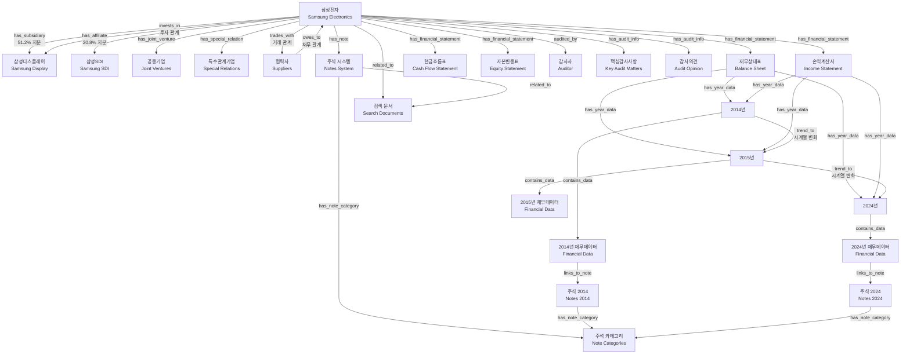
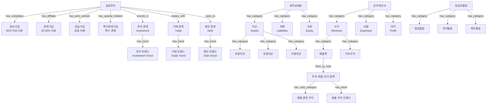
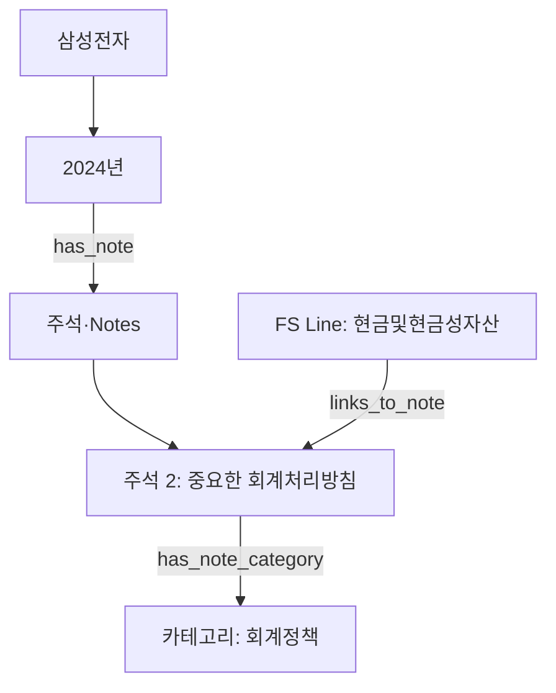
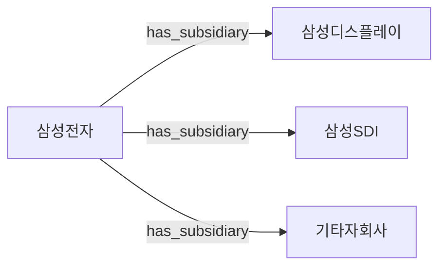

## 🎯 개선된 지식 그래프 구조

### 1. **최종 구현된 전체 아키텍처**



### 2. **세분화된 회사 관계 및 시계열 구조**



### 3. **종합 시계열 분석 구조**

```mermaid
graph LR
    %% 년도 간 시계열 연결 (재무제표)
    Year2014[2014년] --> |trend_to<br/>재무 변화| Year2015[2015년]
    Year2015 --> |trend_to<br/>재무 변화| Year2016[2016년]
    Year2016 --> |trend_to<br/>재무 변화| Year2017[2017년]
    Year2017 --> |trend_to<br/>재무 변화| Year2018[2018년]
    Year2018 --> |trend_to<br/>재무 변화| Year2019[2019년]
    Year2019 --> |trend_to<br/>재무 변화| Year2020[2020년]
    Year2020 --> |trend_to<br/>재무 변화| Year2021[2021년]
    Year2021 --> |trend_to<br/>재무 변화| Year2022[2022년]
    Year2022 --> |trend_to<br/>재무 변화| Year2023[2023년]
    Year2023 --> |trend_to<br/>재무 변화| Year2024[2024년]
    
    %% 각 년도별 데이터 및 트렌드 분석
    Year2014 --> |contains_data| Data2014[2014년 재무데이터]
    Year2014 --> |has_trend| Trend2014[2014년 트렌드 분석]
    
    Year2024 --> |contains_data| Data2024[2024년 재무데이터]
    Year2024 --> |has_trend| Trend2024[2024년 트렌드 분석]
    
    %% 회사 관계의 시계열 변화
    Data2014 --> |has_relationship| Rel2014[2014년 회사 관계]
    Data2024 --> |has_relationship| Rel2024[2024년 회사 관계]
    Rel2014 --> |has_change| RelChange[관계 변화 추적]
    Rel2024 --> |has_change| RelChange
    
    %% 주석의 시계열 변화
    Data2014 --> |links_to_note| Note2014[2014년 주석]
    Data2024 --> |links_to_note| Note2024[2024년 주석]
    Note2014 --> |has_change| NoteChange[주석 변화 추적]
    Note2024 --> |has_change| NoteChange
```



### 4. **최종 구현된 노드 타입 및 관계 정의**

#### 4.1 확장된 Node Types
```python
NODE_TYPES = {
    # 기본 구조
    "COMPANY": "company",                    # 삼성전자
    "SUBSIDIARY": "subsidiary",              # 종속기업 (50% 이상 지분)
    "AFFILIATE": "affiliate",                # 관계기업 (20-50% 지분)
    "JOINT_VENTURE": "joint_venture",        # 공동기업
    "SPECIAL_RELATION": "special_relation",  # 특수관계기업
    
    # 재무제표 구조
    "FS_SECTION": "financial_statement",     # 재무제표 섹션
    "FS_CATEGORY": "fs_category",            # 재무제표 세부 카테고리
    "YEAR_NODE": "year_node",                # 년도별 노드
    "FINANCIAL_DATA": "financial_data",      # 실제 재무 데이터
    
    # 감사 정보
    "AUDITOR": "auditor",                    # 감사사
    "AUDIT_INFO": "audit_info",              # 감사 정보
    
    # 주석 시스템
    "NOTE": "note",                          # 주석 본문
    "NOTE_CATEGORY": "note_category",        # 주석 유형
    
    # 시계열 분석
    "FINANCIAL_TREND": "financial_trend",    # 재무 트렌드 분석
    "RELATIONSHIP_CHANGE": "relationship_change", # 관계 변화 추적
    
    # 검색 및 개념
    "CONCEPT": "concept",                    # 재무 개념
    "RISK_TERM": "risk_term",                # 리스크 용어
    "SEARCH_DOC": "search_doc"               # 검색 문서
}
```

#### 4.2 확장된 Relationship Types
```python
RELATIONSHIP_TYPES = {
    # 회사 관계 세분화
    "HAS_SUBSIDIARY": "has_subsidiary",           # 종속기업 관계
    "HAS_AFFILIATE": "has_affiliate",             # 관계기업 관계
    "HAS_JOINT_VENTURE": "has_joint_venture",     # 공동기업 관계
    "HAS_SPECIAL_RELATION": "has_special_relation", # 특수관계기업
    
    # 회사간 재무 관계
    "INVESTS_IN": "invests_in",                   # 투자 관계
    "TRADES_WITH": "trades_with",                 # 거래 관계
    "OWES_TO": "owes_to",                         # 채무 관계
    "GUARANTEES_FOR": "guarantees_for",           # 보증 관계
    
    # 재무제표 구조
    "HAS_FINANCIAL_STATEMENT": "has_financial_statement",
    "HAS_CATEGORY": "has_category",
    "HAS_YEAR_DATA": "has_year_data",
    "CONTAINS_DATA": "contains_data",
    
    # 감사 정보
    "AUDITED_BY": "audited_by",
    "HAS_AUDIT_INFO": "has_audit_info",
    
    # 주석 시스템
    "HAS_NOTE": "has_note",
    "HAS_NOTE_CATEGORY": "has_note_category",
    "LINKS_TO_NOTE": "links_to_note",
    
    # 시계열 분석
    "TREND_TO": "trend_to",                       # 시계열 트렌드
    "HAS_TREND": "has_trend",                     # 트렌드 관계
    "HAS_CHANGE": "has_change",                   # 변화 관계
    "PRECEDES": "precedes",                       # 시간적 선후 관계
    
    # 일반 관계
    "RELATED_TO": "related_to",
    "MAPPED_TO": "mapped_to"
}
```

### 5. **최종 구현된 ETL 아키텍처**

#### 5.1 확장된 ETL 로더 구조
```
src/structured_etl/
├── kg_schema.py                    # 확장된 스키마 정의
├── etl_config.py                   # ETL 설정 및 구성
├── id_utils.py                     # 노드 ID 생성 유틸리티
├── neo4j_client.py                 # Neo4j 연결 관리
├── schema_apply.py                 # 제약조건 및 인덱스 적용
├── etl_optimized.py                # 최적화된 ETL 실행기
├── validate_graph.py               # 그래프 검증
│
├── load_company_enhanced.py        # 세분화된 회사 관계 로드
├── load_financial_relationships.py # 회사간 재무 관계 로드
├── load_financial_trends.py        # 재무 트렌드 분석 로드
├── track_relationship_changes.py   # 관계 변화 추적
├── load_fs_sections.py             # FS_SECTION 노드 로드
├── load_fs_categories.py           # FS_CATEGORY 노드 로드
├── load_year_nodes.py              # YEAR_NODE 노드 로드
├── load_financial_data_optimized.py # FINANCIAL_DATA 노드 로드
├── load_audit_info.py              # AUDITOR, AUDIT_INFO 노드 로드
├── load_notes.py                   # NOTE, NOTE_CATEGORY 노드 로드
├── load_concepts.py                # CONCEPT 노드 로드
├── load_risk_terms.py              # RISK_TERM 노드 로드
├── load_search_docs.py             # SEARCH_DOC 노드 로드
├── link_notes.py                   # 재무데이터-주석 링크 생성
├── link_trends.py                  # 시계열 트렌드 관계 생성
│
└── cli.py                          # CLI 인터페이스
```

#### 5.2 확장된 속성 정의 (PROPS)
```python
PROPS = {
    # 기본 식별자
    "id": "id",
    "name": "name", 
    "year": "year",
    "company": "company",
    
    # 회사 관계 속성
    "ownership_percentage": "ownership_percentage",  # 지분율
    "relationship_type": "relationship_type",        # 관계 유형
    "investment_amount": "investment_amount",        # 투자 금액
    "trade_amount": "trade_amount",                  # 거래 금액
    "debt_amount": "debt_amount",                    # 채무 금액
    
    # 재무제표 구조
    "section_code": "section_code",                  # BS | PL | CI | CF | EQ
    "category_path": "category_path",                # Assets>CurrentAssets>Cash
    "category_name": "category_name",
    "hierarchy_level": "hierarchy_level",
    
    # 재무 데이터
    "item_name": "item_name",
    "column_name": "column_name", 
    "original_text": "original_text",
    "value": "value",
    "unit": "unit",
    "currency": "currency",
    "is_negative": "is_negative",
    "note_references": "note_references",
    
    # 주석 관련
    "note_number": "note_number",
    "category": "category",
    "confidence": "confidence",
    "text": "text",
    "content": "content",
    
    # 감사 정보
    "audit_type": "audit_type",
    "audit_opinion": "audit_opinion", 
    "audit_date": "audit_date",
    "auditor_name": "auditor_name",
    
    # 시계열 분석
    "change_rate": "change_rate",                    # 변화율
    "change_amount": "change_amount",                # 변화량
    "trend_direction": "trend_direction",            # 트렌드 방향
    "volatility": "volatility",                      # 변동성
    "growth_rate": "growth_rate",                    # 성장률
    
    # 회사간 재무 관계
    "transaction_type": "transaction_type",
    "amount_current": "amount_current",
    "amount_previous": "amount_previous",
    "transaction_direction": "transaction_direction",
    "reporting_year": "reporting_year",
    "guarantee_type": "guarantee_type",
    "guarantee_limit": "guarantee_limit",
    "collateral_type": "collateral_type",
    "interest_rate": "interest_rate",
    "maturity_date": "maturity_date",
    "transaction_details": "transaction_details"
}
```

### 6. **최종 구현된 시각화 레이어 구조**

```
Layer 1: 세분화된 회사 관계
├── 삼성전자 (중앙)
├── 종속기업 (50% 이상 지분)
│   ├── 삼성디스플레이
│   └── 기타 종속기업
├── 관계기업 (20-50% 지분)
│   ├── 삼성SDI
│   └── 기타 관계기업
├── 공동기업 (공동 지배)
└── 특수관계기업

Layer 2: 회사간 재무 관계 (시계열)
├── 투자 관계 (INVESTS_IN)
│   ├── 투자 금액 변화
│   └── 지분율 변화
├── 거래 관계 (TRADES_WITH)
│   ├── 매출/매입 변화
│   └── 거래 패턴 분석
├── 채무 관계 (OWES_TO)
│   ├── 미수금/미지급금
│   └── 채무 구조 변화
└── 보증 관계 (GUARANTEES_FOR)

Layer 3: 재무제표 섹션 (시계열 연결)
├── 재무상태표 (BS)
│   ├── 2014년 → 2024년 (TREND_TO)
│   └── 자산/부채/자본 변화
├── 손익계산서 (PL)
│   ├── 2014년 → 2024년 (TREND_TO)
│   └── 수익/비용/이익 변화
├── 현금흐름표 (CF)
└── 자본변동표 (EQ)

Layer 4: 재무제표 세부 카테고리
├── 자산 (Assets)
│   ├── 유동자산 변화 추적
│   ├── 유형자산 변화 추적
│   └── 무형자산 변화 추적
├── 수익 (Revenue)
│   ├── 매출액 트렌드
│   └── 기타수익 패턴
├── 비용 (Expenses)
│   ├── 매출원가 분석
│   └── 판관비 변화
└── 현금흐름 (Cash Flow)
    ├── 영업활동 현금흐름
    ├── 투자활동 현금흐름
    └── 재무활동 현금흐름

Layer 5: 주석-재무데이터 연계
├── 주석 카테고리별 분석
│   ├── 회계정책 변화
│   ├── 재무상태 변화
│   └── 손익계산 변화
├── 재무데이터-주석 연결
│   ├── LINKS_TO_NOTE 관계
│   └── 양방향 탐색 지원
└── 주석 시계열 변화
    ├── 주석 내용 변화
    └── 정책 변경 영향 분석

Layer 6: 종합 분석 및 트렌드
├── 재무 트렌드 분석
│   ├── 성장률 분석
│   ├── 변동성 분석
│   └── 계절성 분석
├── 관계 변화 추적
│   ├── 투자 관계 변화
│   ├── 거래 관계 변화
│   └── 채무 관계 변화
└── 종합 대시보드
    ├── 네트워크 시각화
    ├── 트렌드 차트
    └── 검색 및 필터링
```

### 7. **사용자 인터페이스 제안**

```
📊 삼성전자 지식 그래프
├── 회사 정보
│   ├── 기본 정보
│   ├── 자회사 관계
│   └── 감사 정보
├── 재무제표
│   ├── 재무상태표
│   │   ├── 2014년 → 2024년
│   │   └── 자산/부채/자본 세부
│   ├── 손익계산서
│   │   ├── 2014년 → 2024년
│   │   └── 수익/비용/이익 세부
│   ├── 현금흐름표
│   └── 자본변동표
├── 분석 도구
│   ├── 시계열 분석
│   ├── 비율 분석
│   ├── 비교 분석
│   └── 트렌드 분석
└── 검색 및 필터
    ├── 키워드 검색
    ├── 연도별 필터
    ├── 섹션별 필터
    └── 고급 검색
```


### 8. **주석(Notes) 통합 설계**

#### 8.1 노드/관계 타입 확장

```python
# 노드 타입 (추가)
NODE_TYPES.update({
    "NOTE": "note",                 # 주석 본문(번호/제목/본문/유형/연도)
    "NOTE_CATEGORY": "note_category" # 주석 유형(회계정책/재무상태/손익계산/…)
})

# 관계 타입 (추가)
RELATIONSHIP_TYPES.update({
    "HAS_NOTE": "has_note",                 # 회사/년도/섹션 → 주석
    "HAS_NOTE_CATEGORY": "has_note_category", # 주석 → 주석유형
    "LINKS_TO_NOTE": "links_to_note"        # 재무제표 라인 → 주석(참조링크)
})
```

#### 8.2 데이터 모델 필드 권장 스키마

```json
{
  "note_id": "SHA1(company|year|note_no)",
  "company_id": "삼성전자",
  "fiscal_year": 2024,
  "note_no": 2,
  "title": "중요한 회계처리방침",
  "body_text": "…",
  "category": "회계정책",
  "subcategory": "기준|변경|추정|기타",
  "confidence": 0.28
}
```

주요 소스
- processed JSON: `sections[].title == "주석"`의 `content`에서 번호별 블록 추출
- 분류: `src/note_classifier.py`의 키워드 기반 카테고리/서브카테고리 매핑 결과 사용
- 링크: 재무표 테이블의 `"주석": { type: "notes_reference", note_numbers: [...] }`

#### 8.3 ETL 매핑

1) 노드 생성
- NOTE: 연도별로 추출된 각 `note_no` → `NOTE` 노드 생성
- NOTE_CATEGORY: 사전 정의된 카테고리(회계정책/재무상태/손익계산/현금흐름/자본변동/관련자거래/우발부채/사업부문/리스크관리/감사정보/기타)

2) 관계 생성
- 회사(or YEAR_NODE) —HAS_NOTE→ NOTE
- NOTE —HAS_NOTE_CATEGORY→ NOTE_CATEGORY
- FS_LINE —LINKS_TO_NOTE→ NOTE  (표의 주석번호 참조 기반)

3) 키 구성
- `note_id = sha1(company|year|note_no)`로 연도별 안정적 식별자 부여
- FS_LINE과 NOTE 연결 시 `(year, note_no)` 조합으로 매칭

#### 8.4 시각화 구조



상호작용 UX
- 년도 노드 클릭 → 해당 연도 `NOTE` 목록 팝업 (카테고리 필터 제공)
- 주석 노드 클릭 → 본문/요약/키워드/연결된 재무라인(역링크) 표시
- 재무라인 노드에서 연결된 주석 빠른 점프 제공

#### 8.5 분석 활용
- 카테고리/연도별 주석 분포 트렌드
- 주석-재무라인 연결망 중심성(어떤 주석이 다수 라인과 연결되는가)
- 회계정책 변경/추정 관련 주석의 연도별 변화 탐지
- 리스크/우발부채 관련 주석의 키워드 추세

#### 8.6 품질/운영 고려사항
- 정규식 추출 한계 보완: 표/리스트/콜론 누락 케이스 처리 규칙 추가
- 동의어/표기변형 사전 확장으로 분류 정밀도 향상
- `confidence` 임계값으로 낮은 신뢰 결과 표기 구분(예: "감지됨(낮음)")
- 재처리 안정성: `note_id` 해시 기반으로 idempotent 보장


# 기존 스키마랑 비교

### 1. **구조적 차이점**

#### 기존 스키마
```
데이터베이스 중심의 관계형 모델
├── 정규화된 테이블 구조
├── 외래키 기반 관계
├── 엔티티별 분리된 테이블
└── SQL 기반 쿼리 최적화
```

#### 제안한 시각화 구조
```
그래프 중심의 노드-엣지 모델
├── 계층적 노드 구조
├── 관계 기반 탐색
├── 시각적 탐색 경로
└── 사용자 중심 인터페이스
```

### 2. **핵심 차이점 상세 분석**

#### A. **데이터 모델링 접근법**

| 구분 | 기존 스키마 | 제안한 구조 |
|------|-------------|-------------|
| **접근법** | 관계형 데이터베이스 | 그래프 데이터베이스 |
| **핵심 개념** | 테이블-행-열 | 노드-엣지-속성 |
| **관계 표현** | 외래키 | 직접 연결 |
| **탐색 방식** | JOIN 쿼리 | 그래프 순회 |

#### B. **회사 및 자회사 관계**

**기존 스키마:**
```sql
COMPANIES {
    company_id INTEGER PK
    name_ko TEXT
    name_en TEXT
    -- 자회사 관계가 명시적으로 정의되지 않음
}

COMPETITOR_RELATIONS {
    company_id INTEGER FK
    competitor_id INTEGER FK
    relation_type TEXT
    -- 경쟁사 관계만 정의
}
```

**제안한 구조:**


#### C. **재무제표 구조 표현**

**기존 스키마:**
```sql
FINANCIAL_STATEMENTS {
    statement_type TEXT -- 'BS', 'PL', 'CF', 'EQ'
    -- 단순한 문자열 분류
}

FINANCIAL_STATEMENT_LINES {
    raw_label TEXT
    concept_id INTEGER FK
    -- 개별 라인 아이템만 표현
}
```

**제안한 구조:**
```
재무상태표 (BS)
├── 자산 (Assets)
│   ├── 유동자산
│   ├── 유형자산
│   └── 무형자산
├── 부채 (Liabilities)
└── 자본 (Equity)
```

#### D. **시간 차원 처리**

**기존 스키마:**
```sql
REPORTS {
    fiscal_year INTEGER
    -- 연도별 보고서만 분리
}

FINANCIAL_STATEMENT_LINES {
    amount_current NUMERIC
    amount_prior NUMERIC
    -- 당기/전기 비교만
}
```

**제안한 구조:**
```
2014년 --trend--> 2015년 --trend--> 2016년 ... --trend--> 2024년
├── 재무상태표 데이터
├── 손익계산서 데이터
└── 현금흐름표 데이터
```

### 3. **주요 개선사항**

#### A. **시각화 친화적 구조**
- **기존**: 테이블 중심의 복잡한 JOIN
- **제안**: 직관적인 노드-엣지 탐색

#### B. **계층적 정보 표현**
- **기존**: 평면적인 테이블 구조
- **제안**: 다단계 계층 구조 (회사 → 섹션 → 년도 → 데이터)

#### C. **사용자 탐색 경로**
- **기존**: SQL 쿼리 작성 필요
- **제안**: 클릭 기반 드릴다운 탐색
