# 자연어 처리 과제: 삼성전자 감사보고서 10년치 금융 NLP 분석 시스템

**마감일**: 2025년 09월 17일 (화) 23:59  
**제출 방법**: 조교 장동준 이메일 (qwer4107@snu.ac.kr) 

## 과제 개요

본 과제는 삼성전자의 2014-2024년 감사보고서 HTML 파일을 활용하여 금융 도메인 특화 NLP 시스템을 구축하는 과제로, HTML 파싱부터 시작하여 최종적으로는 금융 텍스트 분석, 시계열 트렌드 분석, 그리고 실용적인 금융 QA 시스템 중 하나를 구현하는 종합 프로젝트에 해당됩니다. 9월 16일 까지 필수 과제 요구사항은 10년치 삼성전자 감사보고서 HTML 파일을 파싱하고 데이터를 추출하여 통일된 데이터베이스 스키마로 처리하는 모듈 개발입니다.

## 최종 목표

- 1차 목표: HTML 파싱 및 금융 문서 전처리: 복잡한 HTML 구조(표 및 주석 자료)에서 핵심 정보 추출
- 2차 목표: 금융 도메인 NLP 모델 및 파이프라인 구축: 재무제표, 주석, 감사의견 등 금융 텍스트 특화 분석

## 과제 요구사항

### **1차 목표: HTML 파싱 및 데이터 추출**
#### HTML 구조 분석 및 파싱 모듈 개발
- **HTML 구조 분석**: 각 연도별 감사보고서의 구조적 차이점 파악
- **섹션 식별**: 재무제표, 주석, 감사의견 등 주요 섹션 자동 분류
- **표 데이터 추출**: HTML 테이블을 구조화된 데이터로 변환


```python
# 필수 구현 요소들
class AuditReportParser:
    def parse_html(self, file_path):
        """HTML 파일 파싱 및 기본 전처리"""
        pass
    
    def extract_sections(self, parsed_html):
        """주요 섹션별 텍스트 추출"""
        pass
    
    def extract_tables(self, parsed_html):
        """재무제표 및 주요 표 데이터 추출"""
        pass
    
    def normalize_text(self, text):
        """금융 텍스트 정규화 및 정제"""
        pass
```


#### 데이터 품질 검증 장치 개발
- **데이터 검증**: 추출된 데이터의 완성도 및 정확성 검증
- **누락 데이터 처리**: 연도별 누락 정보 식별 및 처리 전략
- **데이터 표준화**: 동일한 정보의 다양한 표현 방식 통일
- **메타데이터 관리**: 추출 일시, 소스 파일, 신뢰도 등 메타정보 관리

#### 구조화된 데이터베이스 구축 
- **스키마 설계**: 금융 정보 특성을 반영한 데이터베이스 스키마(10년 치 자료를 담을 수 있는 통일된 데이터 스키마)
- **관계형 데이터 모델링**: 연도별, 섹션별, 항목별 관계 설정
- **인덱싱 전략**: 효율적인 검색을 위한 인덱스 설계
- **데이터 무결성**: 제약조건 및 검증 규칙 구현
- 본인이 잘 할 수 있는 형태로 스키마를 정의하면 됨. sql을 사용하든 json 형식의 객체형태로 표현 하든 자유.
- 왜 이렇게 스키마를 만들었는지, 누락한 데이터는 왜 했는지 등을 잘 설명할 수 있어야함


### 2차 목표: **최종 응용 시스템**

#### 후보 1. 금융 개체명 인식 (NER) 시스템 개발
- **금융 엔티티 정의**: 회사명, 계정과목, 금액, 비율, 날짜 등
- **커스텀 NER 모델**: 금융 도메인 특화 개체명 인식 모델 구축
- **규칙 기반 후처리**: 금융 용어의 특수성을 반영한 규칙 적용
- **성능 평가**: 수동 라벨링을 통한 정확도 측정

#### 후보 2. 금융 감정 분석 및 리스크 탐지 시스템 개발
- **감사의견 분석**: 적정의견, 한정의견 등 감사의견의 미묘한 차이 분석
- **리스크 키워드 탐지**: 우려사항, 불확실성, 제약사항 등 리스크 신호 식별
- **톤 변화 분석**: 연도별 경영진 논의 및 분석의 톤 변화 추적
- **정량적 지표 연계**: 감정 점수와 실제 재무지표의 상관관계 분석

#### 후보 3. 주제 모델링 및 토픽 트렌드 시스템 개발
- **동적 토픽 모델링**: 10년간 주요 토픽의 변화 추적
- **금융 토픽 분류**: ESG, 디지털 전환, 글로벌 확장 등 주요 테마 식별
- **토픽 진화 분석**: 새로운 토픽의 등장과 기존 토픽의 소멸 패턴
- **외부 이벤트 연관성**: 경제 위기, 규제 변화 등과 토픽 변화의 연관성

#### 후보 4. 재무 지표 시계열 분석 시스템 개발
- **핵심 지표 추출**: 매출, 영업이익, 부채비율 등 주요 재무지표
- **시계열 패턴 분석**: 계절성, 트렌드, 이상치 탐지
- **변동성 분석**: 재무지표의 변동성 및 안정성 평가

#### 후보 5. 텍스트-수치 연관성 분석 시스템 개발
- **경영진 설명과 실적 연관성**: 정성적 설명과 정량적 결과의 일치성 분석
- **선행 지표 발굴**: 텍스트에서 미래 실적을 예측할 수 있는 신호 탐지
- **감정과 성과의 상관관계**: 텍스트 감정 점수와 재무 성과의 관계
- **예측 모델 개선**: 텍스트 정보를 활용한 재무 예측 정확도 향상

#### 후보 6. 이상 탐지 및 경고 시스템 개발
- **재무 이상 패턴**: 급격한 지표 변화나 비정상적 패턴 탐지
- **텍스트 이상 신호**: 기존 패턴과 다른 서술 방식이나 새로운 우려사항
- **조기 경고 시스템**: 잠재적 리스크를 사전에 알리는 알림 시스템
- **신뢰도 평가**: 이상 탐지 결과의 신뢰도 및 정확도 평가

#### 후보 7. 금융 지식 그래프 구축
- **엔티티 관계 모델링**: 회사, 사업부문, 재무항목 간의 관계 정의
- **시간 차원 통합**: 연도별 변화를 반영한 동적 지식 그래프
- **외부 지식 연계**: 산업 분류, 경쟁사 정보 등 외부 지식과의 연결
- **그래프 검색 최적화**: 복잡한 질의에 대한 효율적인 검색 알고리즘

#### 후보 8. RAG 기반 QA 시스템
- **하이브리드 검색**: 키워드 검색과 의미 검색의 결합
- **컨텍스트 인식 답변**: 질문의 맥락을 이해한 정확한 답변 생성
- **출처 추적**: 답변의 근거가 되는 원문 위치 및 신뢰도 제공
- **다중 문서 추론**: 여러 연도의 정보를 종합한 답변 생성


## 제출 형식

### 디렉토리 구조 (예시)
```
samsung-audit-nlp-analysis/
├── README.md                           # 프로젝트 개요 및 실행 가이드
├── requirements.txt                    # 의존성 목록
├── config/
│   ├── parser_config.yaml            # HTML 파싱 설정
│   ├── nlp_config.yaml               # NLP 모델 설정
│   └── database_config.yaml          # 데이터베이스 설정
├── src/
│   ├── data_processing/
│   │   ├── html_parser.py            # HTML 파싱 모듈
│   │   ├── text_cleaner.py           # 텍스트 전처리
│   │   ├── table_extractor.py        # 표 데이터 추출
│   │   └── data_validator.py         # 데이터 검증
│   ├── nlp_analysis/
│   │   ├── financial_ner.py          # 금융 개체명 인식
│   │   ├── sentiment_analyzer.py     # 감정 분석
│   │   ├── topic_modeling.py         # 토픽 모델링
│   │   └── risk_detector.py          # 리스크 탐지
│   ├── time_series/
│   │   ├── financial_metrics.py      # 재무지표 분석
│   │   ├── trend_analyzer.py         # 트렌드 분석
│   │   ├── anomaly_detector.py       # 이상 탐지
│   │   └── predictor.py              # 예측 모델
│   ├── knowledge_graph/
│   │   ├── graph_builder.py          # 지식 그래프 구축
│   │   ├── entity_linker.py          # 엔티티 연결
│   │   └── graph_querier.py          # 그래프 질의
│   ├── qa_system/
│   │   ├── retriever.py              # 정보 검색
│   │   ├── generator.py              # 답변 생성
│   │   ├── ranker.py                 # 답변 순위화
│   │   └── interface.py              # 사용자 인터페이스
│   └── evaluation/
│       ├── metrics.py                # 평가 지표
│       ├── benchmark.py              # 벤치마크
│       └── validator.py              # 결과 검증
├── data/
│   ├── raw/                          # 원본 HTML 파일들
│   ├── processed/                    # 전처리된 데이터
│   ├── structured/                   # 구조화된 데이터베이스
│   └── external/                     # 외부 참조 데이터
├── models/
│   ├── ner_models/                   # NER 모델들
│   ├── sentiment_models/             # 감정 분석 모델들
│   ├── topic_models/                 # 토픽 모델들
│   └── qa_models/                    # QA 모델들
├── notebooks/
│   ├── 01_data_exploration.ipynb     # 데이터 탐색
│   ├── 02_html_parsing_analysis.ipynb # HTML 파싱 분석
│   ├── 03_nlp_experiments.ipynb      # NLP 실험
│   ├── 04_time_series_analysis.ipynb # 시계열 분석
│   ├── 05_knowledge_graph_viz.ipynb  # 지식 그래프 시각화
│   ├── 06_qa_system_demo.ipynb       # QA 시스템 데모
│   └── 07_final_analysis.ipynb       # 최종 분석 결과
├── tests/
│   ├── test_parser.py                # 파서 테스트
│   ├── test_nlp.py                   # NLP 모듈 테스트
│   ├── test_qa.py                    # QA 시스템 테스트
│   └── test_integration.py           # 통합 테스트
├── docs/
│   ├── technical_report.md           # 기술 보고서
│   ├── methodology.md                # 방법론 설명
│   ├── findings.md                   # 주요 발견사항
│   └── api_documentation.md          # API 문서
└── results/
    ├── visualizations/               # 분석 결과 시각화
    ├── reports/                      # 자동 생성 보고서
    ├── benchmarks/                   # 성능 평가 결과
    └── case_studies/                 # 사례 연구
```

### 평가 관련
- 중간 결과물 제출: 09월 15일 (월) 23:59 
- 최종 발표: 09월 25일 (목) - 결과 발표 및 시연
---

- 모든 코드는 재현 가능해야 하며, 실행 환경을 명확히 문서화
- 외부 API 사용 시 비용 및 사용 제한 고려
- 개인정보 및 민감 정보 처리 시 적절한 마스킹 처리
- 학술적 정직성 준수 - 참조한 모든 자료 명시


1. **단계적 접근**: 파싱 → NLP 알고리즘 → 전처리 → 최종 결과물 순으로 점진적 구현
2. **조기 검증**: 각 단계별로 중간 결과물 검증 및 피드백 반영
3. **도메인 이해**: 금융 용어와 감사보고서 구조에 대한 충분한 학습
4. **사용자 관점**: 실제 금융 전문가가 사용한다는 관점에서 설계


---
*서울대학교 빅데이터 핀테크 전문가 과정*  
*조교 장동준*

---

# 참고

test, validation 처럼 나누지 말고

2014 ~ 2023년도 데이터로 시스템 개발

2024년도껄로 시스템 검증하기!

각 팀별로 깃헙 파고, 조교님 초대


필수 요구사항
- 원본, 전처리한 데이터
- 전처리에 사용한 코드
- requirements.txt
- DB를 그렇게 설계 했는지
- 1차 목표는 전부 다 파싱을 하는거긴 한데, 2차 주제 선정에 따라 안쓰는게 있다면 그것을 납득 가능하게 설명가능해야함
  

---

# E-R 다이어그램

```mermaid

erDiagram
  COMPANIES ||--o{ FILINGS : "files"
  FILINGS   ||--o{ STATEMENTS : "contains"
  STATEMENTS ||--o{ STATEMENT_LINES : "presents"
  STATEMENT_LINES ||--o{ FACTS : "holds"
  TAXONOMY  ||--o{ STATEMENT_LINES : "uses(metric)"
  TAXONOMY  ||--o{ FACTS : "measures(metric)"
  TAXONOMY  ||--o{ TAXONOMY : "parent_of"
  STATEMENT_LINES ||--o{ STATEMENT_LINES : "parent_of"
  FILINGS ||--o{ FOOTNOTES : "has"
  FOOTNOTES ||--o{ FACTS : "annotates"
  FILINGS ||--o{ DATA_QUALITY_ISSUES : "has"
  FACTS ||--o{ FACT_DIMENSION_BRIDGE : "qualified_by"
  DIMENSION_MEMBER ||--o{ FACT_DIMENSION_BRIDGE : "links"
  FILINGS }o--o{ FILINGS : "replaces / replaced_by"

  COMPANIES {
    TEXT company_id PK
    TEXT name_ko
    TEXT name_en
    TEXT ticker
    TEXT industry_kis
    TEXT industry_gics
  }

  FILINGS {
    TEXT filing_id PK
    TEXT company_id FK
    TEXT filing_type       "사업/반기/1Q/3Q"
    ENUM basis             "consolidated|separate"
    INT  fiscal_year
    TEXT period_label      "FY/H1/Q1/Q3"
    DATE start_date
    DATE end_date
    TEXT currency_code
    INT  unit_scale        "원/천원 등"
    TEXT auditor
    TEXT audit_opinion
    TEXT icfr_opinion
    TEXT dart_rcp_no
    INT  amendment_no
    TEXT replaces_filing_id FK
  }

  STATEMENTS {
    TEXT statement_id PK
    TEXT filing_id FK
    ENUM statement_type    "BS/PL/CF/EQ"
    BOOL is_cumulative     "PL/CF YTD 여부"
    TEXT presentation_note
  }

  TAXONOMY {
    TEXT metric_id PK
    TEXT metric_code UK    "ifrs-full:Revenue 등"
    TEXT label_ko
    TEXT label_en
    ENUM statement_type    "BS/PL/CF/EQ"
    TEXT data_type         "numeric/text"
    TEXT balance           "debit/credit"
    BOOL is_total
    TEXT parent_metric_id FK
  }

  STATEMENT_LINES {
    TEXT line_id PK
    TEXT statement_id FK
    TEXT metric_id FK
    TEXT display_label
    INT  order_no
    INT  level
    TEXT parent_line_id FK
    BOOL is_abstract
  }

  FACTS {
    TEXT fact_id PK
    TEXT line_id FK
    TEXT metric_id FK
    NUMERIC value_num
    TEXT value_text
    TEXT unit_code
    INT  decimals
    JSONB dimensions       "세그먼트/지역/제품 JSON"
    TEXT footnote_id FK
    TEXT source_cell
  }

  FOOTNOTES {
    TEXT footnote_id PK
    TEXT filing_id FK
    TEXT note_type
    TEXT content
  }

  DATA_QUALITY_ISSUES {
    TEXT issue_id PK
    TEXT filing_id FK
    TEXT severity
    TEXT rule_code
    TEXT message
    TEXT context
  }

  DIMENSION_MEMBER {
    TEXT dim_member_id PK
    TEXT dim_type          "segment|region|product"
    TEXT code
    TEXT label
  }

  FACT_DIMENSION_BRIDGE {
    TEXT fact_id FK
    TEXT dim_member_id FK
  }
```
